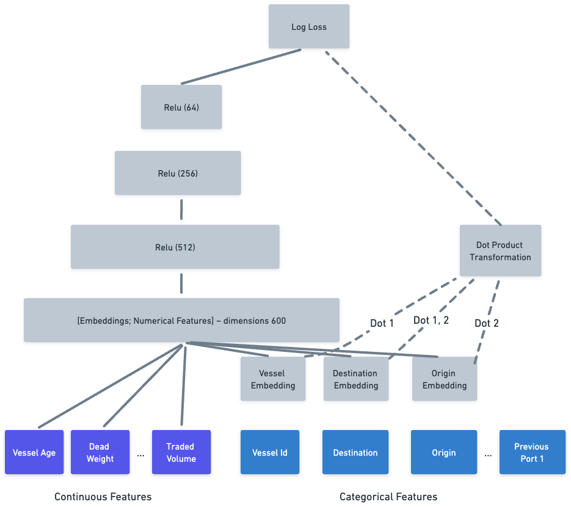
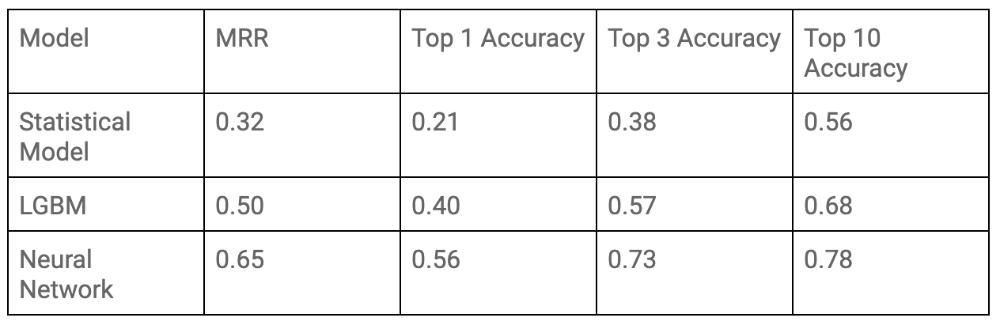
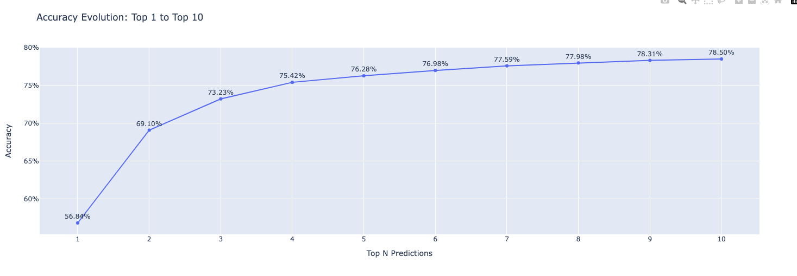
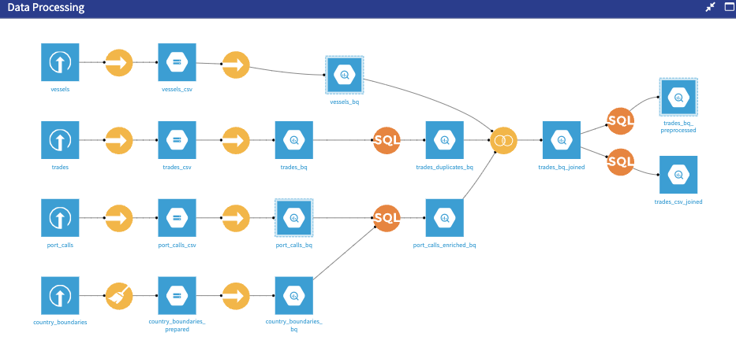
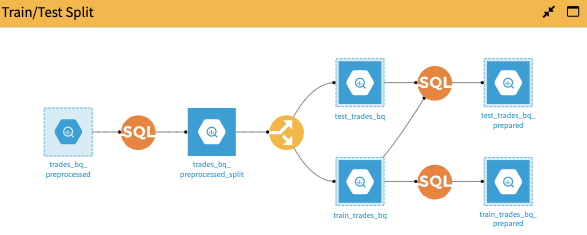
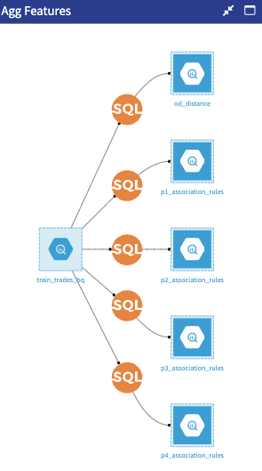
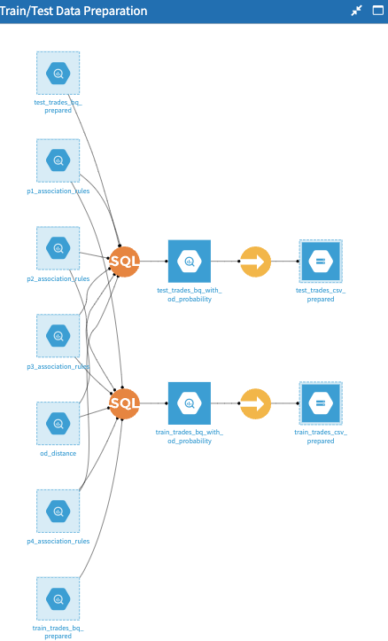

# KplerNextDestination

## Overview
KplerNextDestination is a project focused on predicting vessel destinations in maritime shipping. Using advanced data analysis techniques and machine learning models, this project aims to improve the accuracy of next port predictions, enhancing logistics planning and operational efficiency in the maritime industry.

## Repository Structure
- `EDA_Notebooks/`: Exploratory Data Analysis notebooks -> In order to visualize output cells, one needs to click on "open collab" button as suggested
  - `EDATrades.ipynb`: Analysis of trade data
  - `EDATradesProcessed.ipynb`: Analysis of processed trade data
  - `EDA_PortCallsPart1.ipynb`: Port calls analysis (Part 1)
  - `EDA_PortCallsPart2.ipynb`: Port calls analysis (Part 2)

- `Models_Notebooks/`: Model development and evaluation notebooks -> In order to visualize output cells, one needs to click on "open collab" button as suggested
  - `AssociationRuleTechnique.ipynb`: Implementation of association rule techniques
  - `NNDestinationProbabilityPrediction.ipynb`: Neural Network model for destination probability prediction
  - `lgbmDestinationProbability.ipynb`: LightGBM model for destination probability prediction

- `SQL_Data_Transformation/`: SQL scripts for data processing and feature engineering
  - `Agg_Features/`: Aggregated feature generation
  - `Data_Processing/`: Data cleaning and preprocessing
  - `Train_Test_Data_Preparation/`: Preparation of training and test datasets
  - `Train_Test_Split/`: Scripts for splitting data into training and test sets

- `Report/`: Project documentation and final report

- `images/`: Visualizations and diagrams used in the project

The project tackles three different tasks for building a vessel destination prediction prototype:

* BigQuery Data Transformation Process 
* Python Notebooks for Data Exploration with Plotly
* Python Notebooks for Data Vessel Destination Prediction Prototypes with NN

We propose an neuronal approach to tackle the problem of Next Destination Prediction for Vessels:

Neural Network approach outperforms the other approaches, especially comparing to lgbm approach as presented below:

Below, you can see the evolution of accuracy for different values of k in the top-k prediction:

 
This repository contains the SQL scripts, Jupyter notebooks, and documentation for our data exploration, transformation process using BigQuery and the subsequent vessel destination prediction models.

## Table of Contents
1. [Overview](#overview)
2. [Repository Structure](#repository-structure)
3. [Data Flow](#data-flow)
4. [Transformation Steps](#transformation-steps)
5. [SQL Scripts](#sql-scripts)
6. [Jupyter Notebooks](#jupyter-notebooks)
7. [Execution Instructions](#execution-instructions)
8. [Data Quality Checks](#data-quality-checks)
9. [Performance Considerations](#performance-considerations)
10. [Troubleshooting](#troubleshooting)

## Data Flow

Our data transformation process follows these main stages:

1. Data Ingestion
2. Data Cleaning and Preprocessing
3. Feature Engineering
4. Aggregation and Merging
5. Final Output Preparation

## Transformation Steps

### 1. Data Preparation and Splitting

- SQL Script: `train_test_split.sql`
- Input: Raw trades data
- Output: Preprocessed and split train/test datasets

This step involves cleaning the raw data, handling multiple products per trade, defining voyages, and creating a temporal split for train and test sets.

### 2. Feature Engineering

- Input: Preprocessed trades data
- Output: Trades data with additional engineered features

This step creates new features such as temporal features, voyage sequencing, historical port visits, and distance calculations.

### 3. Probability Calculations

- Input: Preprocessed trades data
- Output: Probability tables for different levels of granularity

These scripts calculate rolling window probabilities for destination prediction at various levels of specificity.

### 4. Final Data Aggregation

- Output: Final dataset ready for model training

This step combines all the processed data and calculated probabilities into a final dataset.

## Jupyter Notebooks

### Exploratory Data Analysis (EDA_Notebooks)

The `EDA_Notebooks/` folder contains Jupyter notebooks used for initial data exploration and analysis. These notebooks provide insights into the dataset's characteristics, distributions, and potential features for our prediction models.

Key notebooks:
- `EDATradesProcessed.ipynb`: Exploration on final version of trades data
- `EDATrades.ipynb`: Exploration on joined trades data with vessels and port calls
- `EDA_PortCallsPart2.ipynb`: Second part of port calls exploration
- `EDA_PortCallsPart1.ipynb`: First part of port calls exploration

### Model Prototypes (Models_Notebooks)

The `Models_Notebooks/` folder contains Jupyter notebooks that implement and evaluate different approaches to vessel destination prediction.

Key notebooks:
- `AssociationRuleTechnique.ipynb`: Implementation of the baseline statistical model using historical probabilities and evaluation
- `lgbmDestinationProbability.ipynb`: Development and evaluation of a Light Gradient Boosting Machine model and evaluation
- `NNDestinationProbabilityPrediction.ipynb`: Implementation of a neural network model with embedding layers and evaluation

These notebooks provide a comprehensive view of our modeling process, from baseline approaches to more sophisticated machine learning techniques.

## Execution Instructions

1. Ensure you have access to the necessary datasets that are shared in Google Drive.
2. Explore the data using the notebooks in the `EDA_Notebooks/` folder.
4. Run the model prototype notebooks in the `Models_Notebooks/` folder to train and evaluate different prediction models.

## Troubleshooting

[Previous content remains, with the following addition:]

For issues related to Jupyter notebooks:
1. **Kernel dies when running large datasets**: 
   - Solution: Consider using a more powerful machine or processing data in smaller batches.
2. **Package import errors**: 
   - Solution: Ensure all required packages are installed. A `requirements.txt` file is provided in the repository root.

For any other issues, please open an issue in this repository with a description of the problem and the relevant query or notebook.

